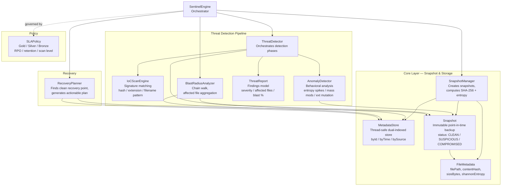
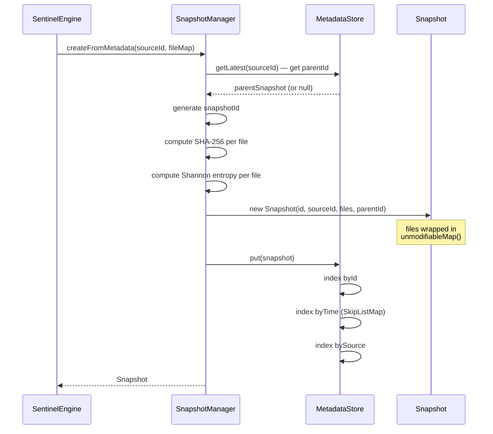
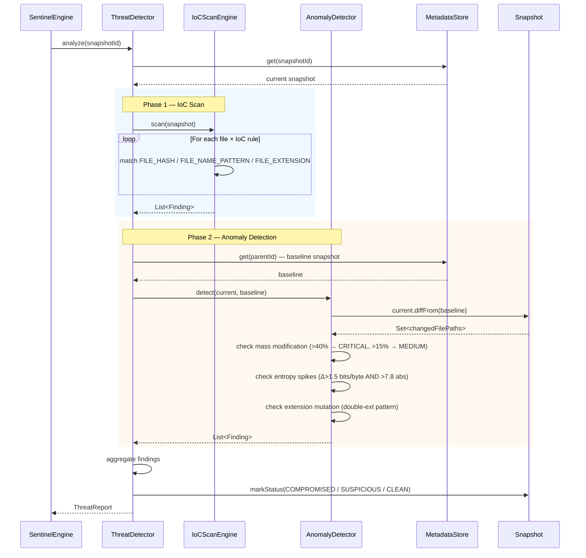
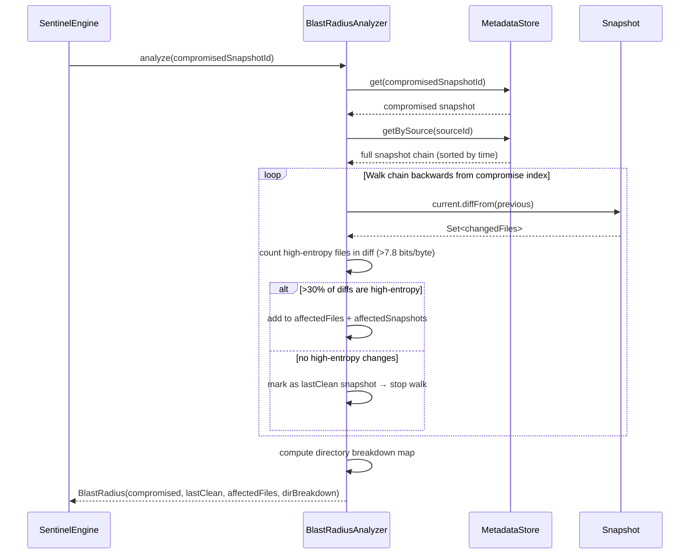
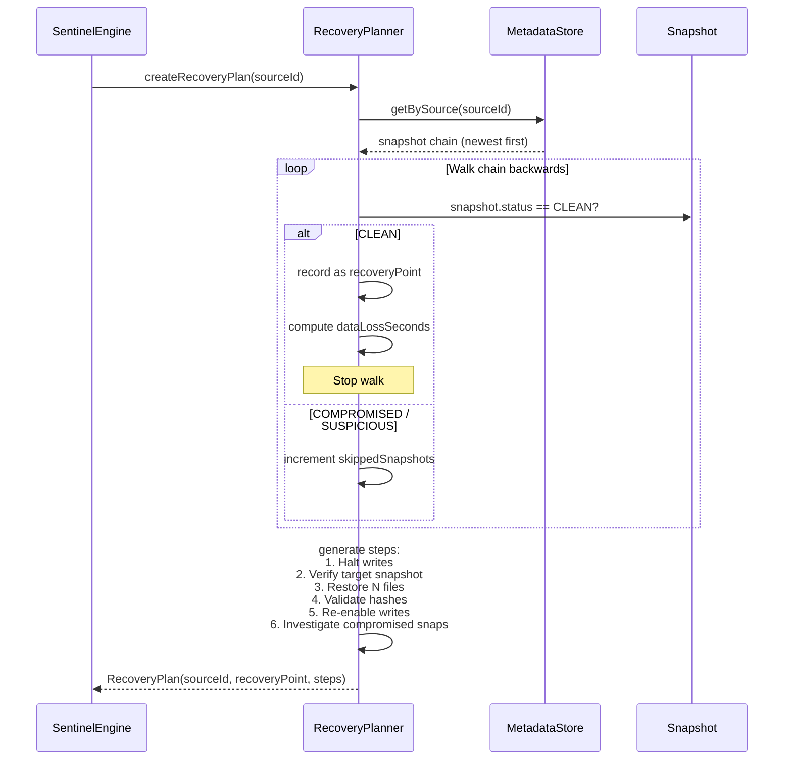
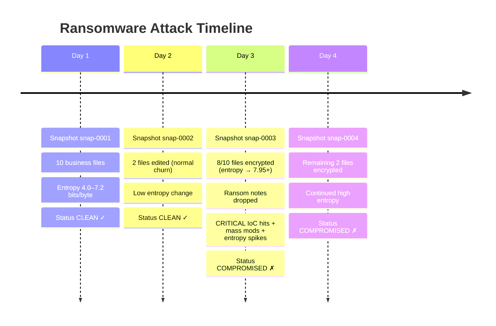

# Rubrik Sentinel — System Design

A snapshot-based data protection and threat detection engine that simulates ransomware attack detection, blast radius analysis, and cyber recovery planning.

---

## High-Level Architecture

```
┌─────────────────────────────────────────────────────────────────────┐
│                         SentinelEngine                              │
│                    (Main Orchestrator + Simulation Runner)          │
└────────┬──────────────┬──────────────┬──────────────┬──────────────┘
         │              │              │              │
         ▼              ▼              ▼              ▼
    ┌─────────┐   ┌──────────┐  ┌──────────┐  ┌──────────┐
    │  core/  │   │ threat/  │  │recovery/ │  │ policy/  │
    │Snapshot │   │ Threat   │  │ Recovery │  │   SLA    │
    │ Layer   │   │Detection │  │ Planner  │  │  Policy  │
    │         │   │ Pipeline │  │          │  │          │
    └─────────┘   └──────────┘  └──────────┘  └──────────┘
```

---

## Component Diagram



---

## Data Flow: Snapshot Creation



---

## Data Flow: Threat Detection Pipeline



---

## Data Flow: Blast Radius Analysis



---

## Data Flow: Recovery Planning



---

## Simulation Scenario: 4-Day Ransomware Attack



**Blast Radius:** 10 affected files across snap-0003 and snap-0004
**Recovery Target:** snap-0002 (Day 2) — 1 day data loss window

---

## Anomaly Detection Thresholds

| Check | Threshold | Severity |
|---|---|---|
| Mass file modification | > 40% of files changed | CRITICAL |
| Mass file modification | > 15% of files changed | MEDIUM |
| Per-file entropy spike | Δ > 1.5 bits/byte AND absolute > 7.8 | HIGH |
| Extension mutation | Double-extension pattern (e.g. `.docx.locked`) | HIGH |
| IoC: ransomware extension | `.locked`, `.encrypted`, `.wnry`, `.cerber`, `.zepto` | HIGH |
| IoC: ransom note | Filename matches `README-DECRYPT`, `restore_files`, etc. | CRITICAL |

---

## SLA Policy Tiers

```
┌──────────────────────────────────────────────────────────────────┐
│  GOLD     │ RPO: 4h   │ Retention: 30d │ Scan: FULL             │
│           │           │                │ (IoC + Anomaly + Blast) │
├──────────────────────────────────────────────────────────────────┤
│  SILVER   │ RPO: 12h  │ Retention: 14d │ Scan: BASIC (IoC only) │
├──────────────────────────────────────────────────────────────────┤
│  BRONZE   │ RPO: 24h  │ Retention: 7d  │ Scan: NONE             │
└──────────────────────────────────────────────────────────────────┘
```

---

## MetadataStore — Indexing Strategy

```
MetadataStore
│
├── byId: ConcurrentHashMap<snapshotId → Snapshot>
│         O(1) lookup by ID
│
├── byTime: ConcurrentSkipListMap<Instant → Snapshot>
│           Ordered; supports getInRange(from, to) time-window queries
│
└── bySource: ConcurrentHashMap<sourceId → List<Snapshot>>
              Lists all snapshots per workload, sorted by creation time
```

---

## Key Design Decisions

| Decision | Rationale |
|---|---|
| Immutable `Snapshot` (unmodifiableMap) | Models air-gapped backups; prevents runtime tampering |
| Entropy pre-computed at ingest | Enables real-time detection without re-reading file data |
| Dual-indexed `MetadataStore` | O(1) by-ID access + ordered time-range queries |
| IoC + Anomaly combined | Catches known threats (signatures) and zero-day (behavior) |
| Chain-walk for blast radius | Determines exactly which snapshots belong to the attack window |
| `volatile` status field on `Snapshot` | Thread-safe status transitions during concurrent detection |
| Stateless detectors | Independently testable; enables parallel execution |
| Policy-driven SLA tiers | Separates governance (what) from execution (how) |

---
